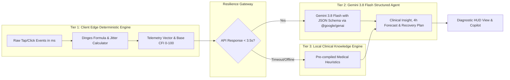

# 02. Tech Stack & Architecture Specification
**Project:** CogniPulse (ICONFEST 2026 - Software Development / Health)  
**Document Status:** Approved Architecture Blueprint (Updated with Gemini 3.8 & Next.js 15)  
**Date:** 2026-09-30  

---

## 1. Tech Stack Selection & Justification

| Layer | Pilihan Teknologi | Alasan Pemilihan & Nilai Kompetitif |
| :--- | :--- | :--- |
| **Framework** | **Next.js 15 (App Router, React 19, TypeScript)** | Standar industri modern. Memungkinkan *Single-Click Deployment* ke Vercel (memenuhi syarat link prototype juri), Server Components untuk efisiensi SEO/initial load, dan Client Components untuk micro-tasks interaktif. |
| **Styling & Design System** | **Tailwind CSS + Custom Clinical Theme Tokens** | Styling deterministik tanpa runtime overhead CSS-in-JS. Memberikan kontrol penuh atas hierarki visual, kontras tinggi, dan responsivitas multi-device. |
| **High-Precision Timing** | **Web Audio API + `performance.now()` + HTML5 Canvas** | Menghindari re-render cycle React untuk pengukuran interval milidetik. Menghasilkan akurasi $\pm 2\text{ms}$ bebas lag animasi. |
| **AI SDK & Model** | **Official `@google/genai` (Gemini 3.8 Flash)** | Model generasi terkini (1M context tokens, ultra-fast latency $< 500\text{ms}$, multimodal reasoning, native Structured Outputs). *Catatan: Model lawas Gemini 2.5/2.0/1.5 telah didepresiasi.* |
| **Data Visualization** | **Recharts + SVG Monospace HUD** | Rendering grafik tren sirkadian, distribusi latensi, dan heatmap kesiapan tim dengan performa tinggi. |
| **Micro-Interactions** | **Emil Kowalski Design Engineering Rules** | Motion terukur (`transform: scale(0.97)` on active, `cubic-bezier(0.16, 1, 0.3, 1)`, zero-jank). |
| **Persistence** | **Local-First IndexedDB / LocalStorage Cache** | Menjaga privasi data pekerja (zero cloud leaks) dan memastikan data benchmark personal tetap tersimpan antar sesi. |

---

## 2. Prinsip Rekayasa Performa (Vercel Best Practices)

Berdasarkan pedoman *Vercel React Best Practices*, implementasi CogniPulse mematuhi aturan berikut:

1. **`rerender-use-ref-transient-values` (Krusial untuk PVT):**
   * Nilai latensi waktu reaksi, timestamp klik, dan koordinat pointer disimpan dalam `useRef` selama tes berlangsung, **bukan** dalam `useState`.
   * State React hanya diperbarui saat ronde tes selesai. Hal ini mencegah re-rendering yang dapat mengganggu akurasi pengukuran waktu.
2. **`rendering-conditional-render`:**
   * Menggunakan ternary (`condition ? <Comp /> : null`) alih-alih `condition && <Comp />` untuk menghindari rendering bug pada angka 0.
3. **`async-parallel` & Anti-Waterfall:**
   * Pengiriman data telemetri ke Gemini dan komputasi metrik lokal dijalankan secara asinkron tanpa memblokir transisi layar ke halaman hasil.
4. **Pointer Event Optimization:**
   * Menggunakan event `onPointerDown` menggantikan `onClick` untuk mengeliminasi latensi delay $\approx 300\text{ms}$ pada perangkat layar sentuh mobile.

---

## 3. Arsitektur Hybrid AI Dual-Engine

Untuk menjamin skor maksimal pada kriteria **Ketepatan Teknologi (30% penyisihan, 45% final)**, sistem dipisahkan menjadi dua lapisan yang saling melengkapi:



### Keunggulan Arsitektur:
1. **Tidak Bergantung Penuh pada Koneksi (Anti-Gagal di Panggung Demo):** Jika internet aula kompetisi lambat, *Tier 3 Local Engine* mengambil alih secara transparan dalam $3.5$ detik. Juri tidak akan pernah melihat layar *loading* macet atau error 500.
2. **AI yang Tepat Guna:** Gemini 3.8 Flash menerima input yang telah terstruktur rapi (vektor statistik, deviasi baseline, dan konteks sirkadian), sehingga output Gemini bukan sekadar menebak angka, melainkan melakukan *clinical reasoning* tingkat tinggi.

---

## 4. Skema Kontrak Data Gemini 3.8 Flash (Structured JSON Schema)

```typescript
export interface GeminiClinicalAnalysis {
  differentialDiagnosis: {
    primaryType: 'cognitive_overload' | 'sleep_deprived_microsleep' | 'neuromuscular_exhaustion' | 'optimal_vigilance';
    severityLevel: 'fit' | 'mild_fatigue' | 'moderate_impairment' | 'critical_safety_hazard';
    confidenceScore: number; // 0.0 - 1.0
    clinicalRationale: string;
  };
  fourHourRiskForecast: {
    decisionErrorProbabilityIncrease: string; // e.g. "+34%"
    reactionTimeDecayTrajectory: string;
    criticalWarningAlert: string | null;
  };
  precisionRecoveryPrescription: {
    immediateAction: string; // e.g., "12-minute Non-Sleep Deep Rest (NSDR)"
    hydrationElectrolyteMl: number;
    recommendedScreenBreakMins: number;
    circadianAlignmentNote: string;
  };
}
```

Implementasi panggilan resmi SDK:
```typescript
import { GoogleGenAI } from "@google/genai";

const client = new GoogleGenAI({});
const interaction = await client.interactions.create({
  model: "gemini-3.8-flash",
  input: JSON.stringify(telemetryPayload),
  system_instruction: "You are a Board-Certified Clinical Neurophysiologist and Fatigue Risk Assessor. Provide JSON-structured clinical triage."
});
```
